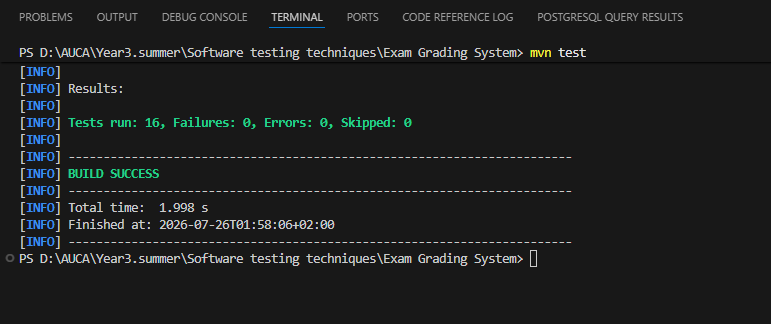
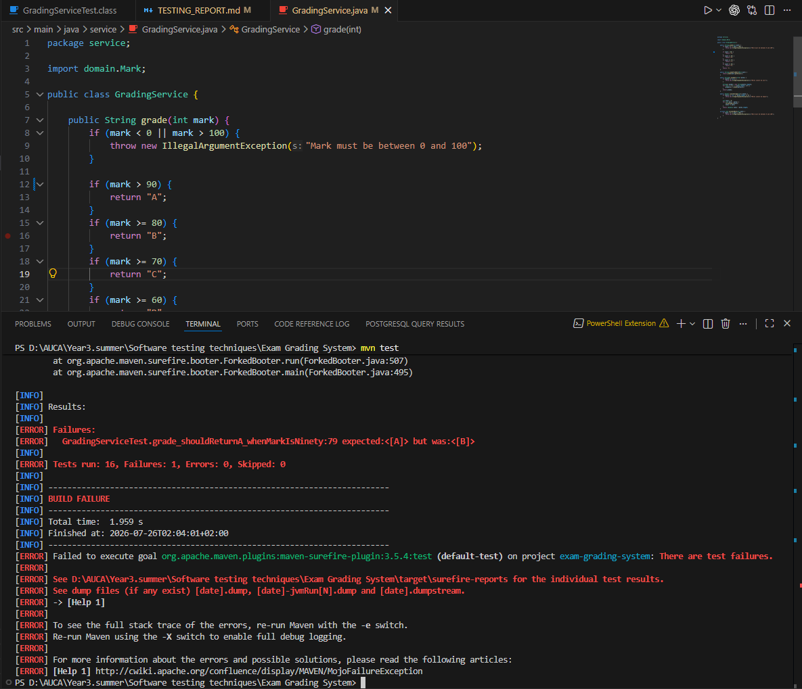

# Exam Grading System

A Maven project built for the Software Testing course at ADVENTIST UNIVERSITY OF CENTRAL AFRICA (AUCA).
It converts raw exam marks into letter grades and is tested using JUnit 4.

---

## Student

| | |
|---|---|
| **Name** | Nganucye Singizwa Valentin |
| **ID** | 27201 |
| **Course** | Software Testing |
| **Semester** | Summer, 2025–2026 |

---

## Project Structure

```
Exam Grading System/
├── pom.xml
├── src/
│   ├── main/java/
│   │   ├── domain/
│   │   │   └── ExamMark.java        ← entity class
│   │   └── service/
│   │       └── GradingService.java  ← business logic
│   └── test/java/
│       └── service/
│           └── GradingServiceTest.java  ← 16 tests
├── Testing_images/
│   ├── build_mvn_test_when_marks_was_equla_to_90.png
│   └── failing_mvn_test_when_marks_was_greater_than_to_90.png
└── TESTING_REPORT.md
```

---

## Grading Rules

| Mark | Grade |
|---:|---|
| 90 – 100 | A |
| 80 – 89 | B |
| 70 – 79 | C |
| 60 – 69 | D |
| 0 – 59 | F |
| Below 0 or above 100 | Error |

---

## How to Run Tests

Make sure you have Java and Maven installed, then run:

```bash
mvn test
```

---

## Test Results

### All tests passing



### Failing test after introducing a bug (mutation testing)

To prove the tests can catch bugs, I changed `mark >= 90` to `mark > 90` and ran `mvn test`. The test for mark 90 failed immediately.



After restoring `>=`, all 16 tests passed again.

---

## Tools Used

- Java 17
- JUnit 4.13.2
- Maven
